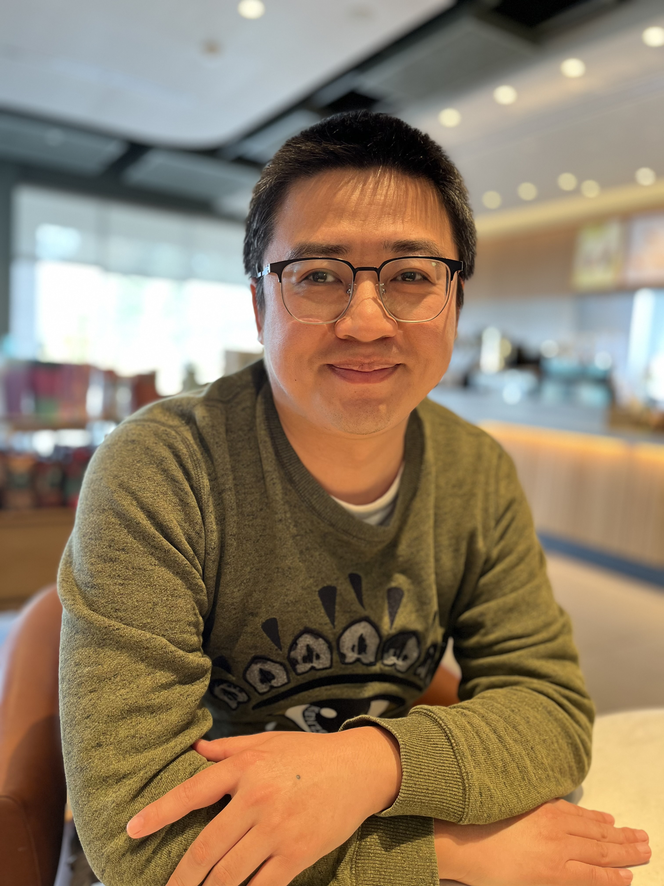

  

### Contact Information
---
- Lei Yang, Department of Mathematics, National University of Singapore, Singapore, 119076
- Email: lei.yang@nus.edu.sg

### Employment
---
- 07/2024-present: Associate Professor, National University of Singapore, Singapore.
- 09/2023-06/2024: Member, IAS, Princeton, USA.
- 09/2017-08/2023: Associate Professor, Sichuan University, China.
- 10/2015-08/2017: Postdoc Fellow, Hebrew University of Jerusalem, Israel.
- 01/2015-05/2015: Postdoc Fellow, MSRI, Berkeley, USA.
- 07/2014-12/2014: Postdoc Fellow, Yale University, USA.

### Education
---
- 2009-2014: PhD in Mathematics, The Ohio State University, USA, Advisor: Nimish Shah.
- 2005-2009: BS in Mathematics, Peking University, China.

